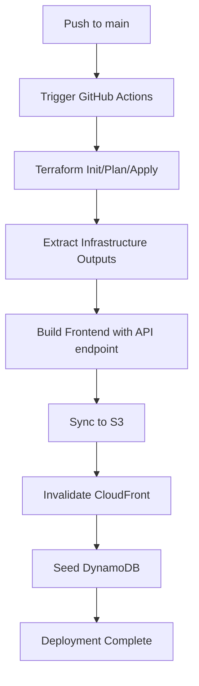

# CD Pipeline Setup Guide

## Quick Setup Steps

### 1. Configure GitHub Secrets

Navigate to your repository: **Settings → Secrets and variables → Actions → New repository secret**

Add these three secrets:

| Secret Name | Value |
|-------------|-------|
| `AWS_ACCESS_KEY_ID` | Your AWS access key ID |
| `AWS_SECRET_ACCESS_KEY` | Your AWS secret access key |
| `AWS_REGION` | `us-east-1` (or your preferred region) |

### 2. Create IAM User for CI/CD

Create an IAM user with programmatic access and attach this minimal policy:

```json
{
  "Version": "2012-10-17",
  "Statement": [
    {
      "Sid": "TerraformStateManagement",
      "Effect": "Allow",
      "Action": [
        "s3:GetObject",
        "s3:PutObject",
        "s3:DeleteObject",
        "s3:ListBucket"
      ],
      "Resource": [
        "arn:aws:s3:::YOUR-TERRAFORM-STATE-BUCKET",
        "arn:aws:s3:::YOUR-TERRAFORM-STATE-BUCKET/*"
      ]
    },
    {
      "Sid": "TerraformResourceManagement",
      "Effect": "Allow",
      "Action": [
        "s3:*",
        "cloudfront:*",
        "lambda:*",
        "apigateway:*",
        "dynamodb:*",
        "sqs:*",
        "ses:*",
        "iam:*",
        "logs:*"
      ],
      "Resource": "*"
    },
    {
      "Sid": "FrontendDeployment",
      "Effect": "Allow",
      "Action": [
        "s3:PutObject",
        "s3:DeleteObject",
        "s3:ListBucket",
        "s3:PutObjectAcl"
      ],
      "Resource": [
        "arn:aws:s3:::*-frontend-*",
        "arn:aws:s3:::*-frontend-*/*"
      ]
    },
    {
      "Sid": "CloudFrontInvalidation",
      "Effect": "Allow",
      "Action": [
        "cloudfront:CreateInvalidation",
        "cloudfront:ListDistributions",
        "cloudfront:GetDistribution"
      ],
      "Resource": "*"
    },
    {
      "Sid": "DynamoDBSeeding",
      "Effect": "Allow",
      "Action": [
        "dynamodb:PutItem",
        "dynamodb:BatchWriteItem"
      ],
      "Resource": "arn:aws:dynamodb:*:*:table/*-products"
    }
  ]
}
```

**Note:** Replace `YOUR-TERRAFORM-STATE-BUCKET` with your actual Terraform state bucket name if using remote state.

### 3. Test the Pipeline

1. Make a small change to your code
2. Commit and push to `main` branch:
   ```powershell
   git add .
   git commit -m "test: trigger CD pipeline"
   git push origin main
   ```
3. Go to GitHub → **Actions** tab
4. Watch the pipeline run

### 4. Verify Deployment

After the pipeline completes, you'll see output like:

```
✅ DEPLOYMENT COMPLETED SUCCESSFULLY
🌐 Frontend URL: https://d1234567890abc.cloudfront.net
🔗 API Endpoint: https://abc123.execute-api.us-east-1.amazonaws.com
📦 S3 Bucket: aws-ecommerce-dev-frontend-is458-2025-abc123
🗃️  Products Table: aws-ecommerce-dev-products
```

Visit the Frontend URL to see your deployed application!

## What Happens on Each Push



## Pipeline Flow Details

### Step 1: Terraform (Infrastructure as Code)
- Initializes Terraform
- Plans infrastructure changes
- Applies changes to AWS
- Outputs: S3 bucket name, API endpoint, DynamoDB table name, CloudFront domain

### Step 2: Build Frontend
- Installs Node.js dependencies
- Creates `.env.production` with API endpoint
- Builds React app with Vite (outputs to `dist/`)

### Step 3: Deploy to S3
- Syncs build files to S3 bucket
- Sets proper cache headers
- Makes files publicly readable

### Step 4: Update CloudFront
- Finds CloudFront distribution
- Creates cache invalidation
- Ensures fresh content delivery

### Step 5: Seed Database
- Runs Python seeder script
- Populates DynamoDB products table
- Uses product data with image URLs

## Troubleshooting

### Pipeline fails at "Terraform Apply"
**Solution:** Check Terraform state and AWS permissions. Run locally first:
```powershell
cd backend/terraform/envs/dev
terraform init
terraform plan
```

### Frontend shows old content
**Solution:** CloudFront cache might not be invalidated. Manually invalidate:
```powershell
aws cloudfront create-invalidation --distribution-id YOUR_DIST_ID --paths "/*"
```

### API calls fail (CORS errors)
**Solution:** Ensure API Gateway has CORS enabled. Check Lambda logs:
```powershell
aws logs tail /aws/lambda/YOUR_FUNCTION_NAME --follow
```

### Seeder fails
**Solution:** Check DynamoDB table exists and IAM permissions. Test locally:
```powershell
python backend/scripts/seed_products.py --table-name YOUR_TABLE --region us-east-1 --dry-run
```

## Local Development vs CD Pipeline

| Aspect | Local Development | CD Pipeline |
|--------|------------------|-------------|
| Terraform | Manual `terraform apply` | Automatic on push |
| Frontend Build | `npm run dev` | `npm run build` |
| API Endpoint | Hardcoded or `.env` | Injected from Terraform |
| Deployment | Manual S3 sync | Automatic S3 sync |
| Database Seed | Manual script run | Automatic after deploy |

## Best Practices

1. **Test locally first** - Always run `terraform plan` and `npm run build` locally before pushing
2. **Use feature branches** - Don't push directly to `main`, use PRs
3. **Monitor deployments** - Watch the Actions tab during deployment
4. **Backup Terraform state** - Use remote state in S3 with locking
5. **Rotate AWS keys** - Change IAM credentials regularly
6. **Use environment-specific settings** - Keep dev/staging/prod separate

## Extending the Pipeline

### Add Testing Stage
Add before deployment:
```yaml
- name: Run Frontend Tests
  working-directory: ${{ env.FRONTEND_DIR }}
  run: npm test
```

### Add Slack Notifications
Add after deployment:
```yaml
- name: Notify Slack
  uses: 8398a7/action-slack@v3
  with:
    status: ${{ job.status }}
    webhook_url: ${{ secrets.SLACK_WEBHOOK }}
```

### Add Staging Environment
Create a separate workflow for staging branch:
- Change `branches: [ "staging" ]`
- Use different Terraform directory: `backend/terraform/envs/staging`

## Security Considerations

- Never commit AWS credentials to the repository
- Use least-privilege IAM policies
- Enable MFA for AWS console access
- Rotate access keys every 90 days
- Use AWS Secrets Manager for sensitive values
- Enable CloudTrail for audit logging

## Support

If you encounter issues:
1. Check GitHub Actions logs
2. Review AWS CloudWatch logs
3. Verify IAM permissions
4. Test each step manually
5. Check Terraform state consistency
